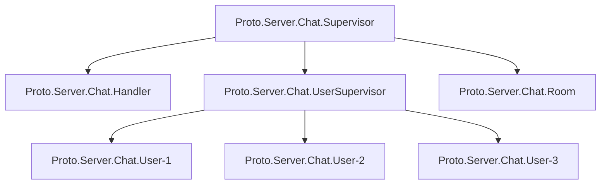

# protohackers

Attempts (& sometimes solutions) to https://protohackers.com/ problems.

Done using elixir, attempting to use minimal libs.

Currently using:
- [Jason](https://hexdocs.pm/jason/readme.html), for handling encoding / decoding JSON into maps.
- [`gen_tcp`](https://www.erlang.org/doc/man/gen_tcp.html) for handling TCP connections.
- Misc. otp-related Elixir things (Application, Supervisor, GenServer, Task, etc.).

## 0: Smoke Test (`lib/server/echo.ex`)

Status: Complete! (157th on leaderboard)

Attempted to do this without `mix` at first, realized quickly I was going to need OTP primitives to better handle multiple clients at the same time, therefore reached for `mix`.

Didn't take too long (mostly because the example on the Elixir docs for how to use `gen_tcp` show how to make an echo server .-.)

Spent some time writing tests for this to ensure it could handle all the spec, mostly as a testing ground since after checking 'Prime time', I knew I wanted to learn how to test without having to poke at stuff using `telnet` each time.

## 1: Prime Time (`lib/server/prime.ex`)

Status: Complete! (102nd on leaderboard)

Took much longer, since I wanted a proper testing setting setup, and did end up bringing in a library to take care of JSON parsing for me.

Thought I had done it, and made it far through the tests, until I hit into a snag with a long test input.
Took some time but eventually figured out it was https://en.wikipedia.org/wiki/Maximum_segment_size related.

Fixed it up by making my own chunk impl., and tada!

## 2: Means to an End (`lib/server/means.ex`)

Status: Complete (181st on leaderboard)

Took and _incredibly_ long time to get this one, had it basically it working about two weeks ago, but one of the later test cases was failing.

Wanted to create a test case around the failing test, so went down the path of trying to figure out how to store all messages being sent to the program in a GenServer I dubbed 'Story'.

I spun my wheels against on for a handful of evenings to no avail.  Giving it another go one afternoon, I ran it multiple times, and it failed on different tests, giving me even more reason to park working on it...

Time progressed, I peeked at other solutions on the protohackers leaderboard, made minor modifications to packet handling logic (switching to prefixing bitstring selector stuff with `signed-size`), re-ran again, and boom, passed.

Didn't make any progress on 3/4 in this timeframe due to stubbornness :)

## 3: Budget Chat (`lib/server/chat.ex`)

Status: Complete (136th on leaderboard)

After completing means to an end, I was hyped to get into this problem (since I had known about it for some time, but didn't want to start it until I had finished the previous question).

Thankfully, this submission worked the first time! Which I believe has been a first, which feels _quite nice_.

I reached for something different this time around as well, instead of a single basic handler, a proper supervision tree to handle the problem, as shown below:

`Proto.Server.Chat.Supervisor` is what is ran under the main supervisor to handle the entire problem.

`Proto.Server.Chat.Handler` spawned by `...Supervisor`, something built similar to every solution up until this point, is a listener / loop accept Task, but once a socket has connected and given a valid name, it will move ownership of the socket over to a `Proto.Server.Chat.User` GenServer that is spawned under the `Proto.Server.Chat.UserSupervisor` dynamic supervisor, with the socket being set to active mode.

The first thing a `...User` GenServer does when it starts, is inform the `Proto.Server.Chat.Room` GenServer it has joined, which manages sending out messages to all currently connected clients a new user has joined

Subsequent messages from the socket handled by `...User`, which will then relay socket data to the `...Room` GenServer, to send out as messages to all clients.

When a socket disconnects, `...User` GenServer handles this by informing `...Room` the user has left.

I took longer than I probably should have to solve this, but it was fun to get my hands dirty with more OTP stuff :)

# 4: Unusual Database Program (`lib/server/database.ex`)

Status: Complete (101st leaderboard)

Man so close to sub-100! I'll get 'em next time :)

This one was fun, while I knew about UDP before this, I had never really worked directly with it, it was nice that most of the API exposed through `gen_udp` was quite similar to `gen_tcp`, but I didn't quite get initially there was no need for a accept loop, but this makes sense, given the lower-level more manual nature of UDP.

I'm pretty happy with the size of the solution, given I didn't use any of the existing handler infrastructure I created during refactors that came along with the previous question.

(Was quite close to solving it the first time as well, but exposed the port for the problem on TCP, not UDP .-.)

# Resources

Misc. stuff I found useful while solving these problems

Some of these are just links to the Elixir docs, but they are pages I have frequented usually for their great examples of OTP primitives

- https://hexdocs.pm/elixir/1.14/GenServer.html
- https://www.openmymind.net/Elegant-TCP-with-Elixir-Part-1-TCP-as-Messages/
- https://learnyousomeerlang.com/buckets-of-sockets
